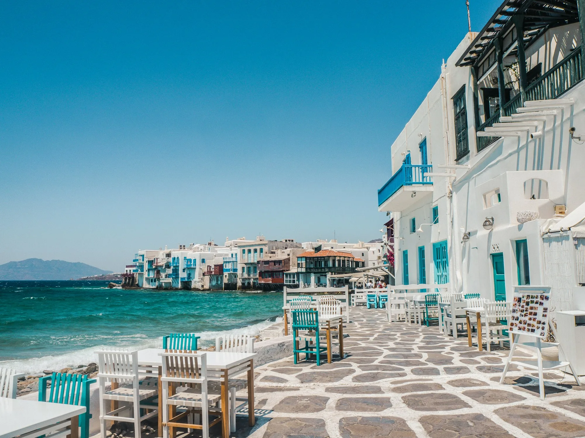

# Crete · WeRoad — 10–12 Luglio

Esperienza digitale per i **18 partecipanti** del weekend a Creta con WeRoad.
Itinerario, voli, hotel, cassa comune, ristoranti, nightlife, checklist, countdown
e roster del gruppo — pensata come una piccola **web app installabile (PWA)** che
funziona anche **offline**.

Sito statico, zero build step. Solo `HTML + CSS + JavaScript` (più GSAP e Lenis via CDN).
Pronto per **GitHub Pages**.

---

## 📁 Struttura del progetto

```
/
├─ index.html              ← tutte le sezioni (semantico, accessibile)
├─ manifest.webmanifest    ← PWA: nome, icone, colori
├─ sw.js                   ← service worker (offline-first)
├─ css/
│  ├─ style.css            ← design system + layout di ogni sezione
│  └─ animations.css       ← reveal on scroll, hero, micro-animazioni
├─ js/
│  ├─ main.js              ← motion, countdown, cassa, checklist, FAQ, render dati
│  ├─ timeline.js          ← dati + render dell'itinerario (3 giorni)
│  └─ maps.js              ← mini-mappa hotel (no API key, offline-safe)
├─ images/
│  ├─ hero/ backgrounds/ food/ nightlife/ icons/ gallery/
├─ python/
│  └─ optimize_images.py   ← JPG/PNG → WebP + thumbnail + compressione
└─ README.md
```

> **Nota sulle immagini:** le foto sono già **incluse in locale** in `/images`
> (caricano ovunque: anteprima, offline, GitHub Pages — nessun dominio esterno).
> Per sostituirle con le tue e ottimizzarle in `.webp`, vedi la sezione qui sotto.
> Ogni immagine ha anche un fallback: se un file manca, al suo posto compare un
> gradiente Egeo invece di un'icona rotta.

---

## 🚀 Anteprima locale

Serve un piccolo server statico (il service worker non funziona aprendo il file con `file://`):

```bash
# Python
python -m http.server 8000
# poi apri http://localhost:8000
```

oppure con Node: `npx serve` .

---

## 🌐 Deploy su GitHub Pages

1. Crea un repository su GitHub e carica **tutto il contenuto della cartella** (non la cartella stessa):
   ```bash
   git init
   git add .
   git commit -m "Crete WeRoad landing"
   git branch -M main
   git remote add origin https://github.com/<utente>/<repo>.git
   git push -u origin main
   ```
2. Su GitHub: **Settings → Pages**.
3. In *Build and deployment* → *Source*: scegli **Deploy from a branch**.
4. *Branch*: `main` · cartella `/ (root)` → **Save**.
5. Dopo ~1 minuto il sito è online su `https://<utente>.github.io/<repo>/`.

> Tutti i percorsi sono **relativi** (`css/…`, `js/…`, `./index.html`), quindi
> funziona anche in una sottocartella come quella di GitHub Pages.

---

## 🖼️ Sostituire e ottimizzare le immagini

### 1. Aggiungi le tue foto
Metti i file in `images/` nelle sottocartelle giuste (`hero/`, `food/`, `nightlife/`…).

### 2. Ottimizzale (consigliato)
```bash
pip install pillow
python python/optimize_images.py            # processa tutta /images
python python/optimize_images.py images/hero --max 2400 --quality 82 --thumb 600
```
Per ogni `foto.jpg` lo script genera:
- `foto.webp` — versione full ridimensionata e compressa (qualità alta)
- `foto-thumb.webp` — miniatura per caricamenti leggeri

Gli originali **non vengono toccati**.

### 3. Collega le immagini locali
Sostituisci gli URL Unsplash con i percorsi locali. Esempi:

- **Hero** — in `index.html`, dentro `.hero__media`:
  ```html
  
  ```
- **Itinerario** — in `js/timeline.js`, campo `img` di ogni giorno.
- **Ristoranti / nightlife / attività** — in `js/main.js`, negli array
  `REST`, `NIGHT`, `EXTRAS` (campo `img`).

> Le immagini del sito sono già in **WebP**. Se aggiungi nuove foto `.jpg`/`.png`,
> rilancia `python python/optimize_images.py` e poi punta i percorsi al file `.webp`.

### Modo facile: doppio clic (Windows)

Per sostituire una foto: salva la tua immagine in **JPG**, rinominala **esattamente**
come il file da sostituire (es. `hotel.jpg`) e mettila nella cartella giusta,
sovrascrivendo la vecchia. Poi **doppio clic su `aggiorna-immagini.bat`**: converte
in WebP e aggiorna la cache da solo. Ricarica il sito con `CTRL+F5`.

### Aggiornare la cache (dopo ogni modifica)

Browser e PWA mettono in cache CSS/JS/immagini. Per far vedere subito le modifiche
agli utenti, **incrementa la versione** con un comando:

```bash
python python/bump_version.py            # auto: es. 16 -> 17
python python/bump_version.py --set 20   # forza una versione
python python/bump_version.py --dry-run  # anteprima, senza scrivere
```

Lo script aggiorna in automatico tutti i `?v=` in `index.html` e il nome della
cache (`crete-weroad-vN`) in `sw.js`. Lancialo prima di ogni `git push`.

---

## ✏️ Personalizzare l'itinerario

Tutto il contenuto è in cima ai file JS, in array facili da modificare:

| Cosa | File | Variabile |
|------|------|-----------|
| Giorni dell'itinerario | `js/timeline.js` | `ITINERARY` |
| Escursione del sabato (testi) | `index.html` | sezione `#escursione` |
| Voli (andata/ritorno, +altri) | `js/main.js` | `FLIGHTS` |
| Come arrivare (van/bus/taxi) | `js/main.js` | `ROUTE` |
| Cassa comune (quota fissa 100 €) | `js/main.js` | `kitty()` → `PER` / `N` |
| Checklist zaino | `js/main.js` | `PACK` |
| Ristoranti | `js/main.js` | `REST` |
| Serate / nightlife | `js/main.js` | `NIGHT` |
| Attività extra | `js/main.js` | `EXTRAS` |
| Roster partecipanti (nome, WeRoad, età) | `js/main.js` | `PEOPLE` |
| Rooming (assegna i nomi alle camere) | `js/main.js` | `ROOMS` → `people: []` |
| Meteo & sole | `js/main.js` | `WEATHER` |
| FAQ | `js/main.js` | `FAQ` |
| Hotel + posizione mappa | `js/maps.js` | `HOTEL` |
| Data del countdown | `js/main.js` | `countdown()` → `target` |

**Aggiungere un volo** è sufficiente aggiungere un oggetto all'array `FLIGHTS`:
```js
{ dir: "Andata · Sab 11 lug", from:{code:"BGY",city:"Bergamo"}, to:{code:"HER",city:"Heraklion"},
  airline:"Ryanair", num:"FR 1234", dep:"07:10", arr:"10:40" }
```

---

## 🎨 Cambiare i colori

Tutta la palette è definita in **variabili CSS** all'inizio di `css/style.css`:

```css
:root {
  --navy:        #13293D;   /* ombra navy   */
  --deep-blue:   #1B4965;   /* blu profondo */
  --turquoise:   #5C9EAD;   /* turchese     */
  --sand:        #E4D5B7;   /* sabbia       */
  --lime-white:  #F7F4EC;   /* bianco calce */
  --sunset:      #D98E73;   /* tramonto     */
}
```

Cambia questi valori e **tutto il sito** si ri-tematizza (header, bottoni, accenti,
cassa comune, mappe). Ricordati di aggiornare anche `theme_color` in
`manifest.webmanifest` e il `<meta name="theme-color">` in `index.html`.

---

## 📱 PWA (installabile + offline)

- `manifest.webmanifest` definisce nome, icone e colori dell'app.
- `sw.js` mette in cache l'app shell e, progressivamente, font e foto.
- Su mobile: apri il sito → menù del browser → **“Aggiungi alla schermata Home”**.

Per le icone, aggiungi due PNG quadrati in `images/icons/`:
`icon-192.png` (192×192) e `icon-512.png` (512×512).
Puoi generarli da un logo con un qualsiasi tool, o con Pillow.

> Dopo ogni modifica importante, incrementa `CACHE = "crete-weroad-v1"` in `sw.js`
> per forzare l'aggiornamento della cache sui telefoni.

---

## 🧱 Stack & scelte tecniche

- **Nessun framework** — HTML/CSS/JS puro, caricamento istantaneo.
- **GSAP + ScrollTrigger** — parallax leggero e animazioni precise.
- **Lenis** — smooth scroll fluido (disattivato con `prefers-reduced-motion`).
- **IntersectionObserver** — reveal on scroll performante.
- **localStorage** — la checklist resta salvata sul dispositivo.
- **Accessibilità** — HTML semantico, focus visibili, `aria-*`, rispetto del
  reduced-motion, contrasti AA, target touch ≥ 44px.
- **Performance** — WebP, lazy loading, immagini con dimensioni, font `display=swap`.

---

## ✅ Checklist pre-partenza (per chi pubblica)

- [ ] Sostituite le foto Unsplash con quelle locali ottimizzate
- [ ] Aggiornati voli reali in `FLIGHTS`
- [ ] Corretti nome hotel e coordinate in `js/maps.js`
- [ ] Verificata la data del countdown
- [ ] Aggiunte le icone PWA (192 e 512)
- [ ] Testato su mobile (375px) e con reduced-motion attivo

Buon viaggio. **See you in Crete.** 🌅
